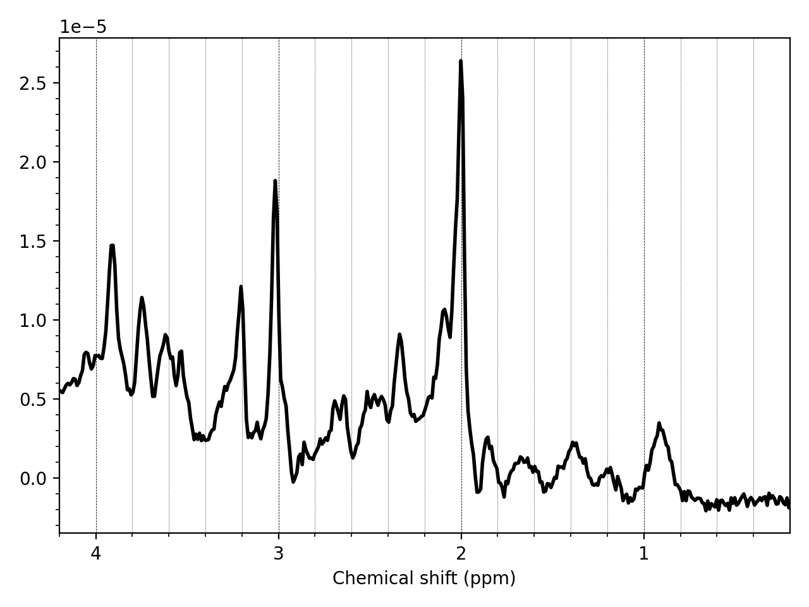

.. _quick_start:

Quick Start Guide
=================

Summary
-------
Below we describe an end-to-end pipeline that includes data conversion, processing, model fitting, quantification, and visualisation of the results. To apply this step to the example data provided with FSL-MRS see the `example_usage` section in the main package.

1. Convert your data
~~~~~~~~~~~~~~~~~~~~
Before running FSL-MRS, time domain data must be prepared in a complex 4D-NIFTI + json format. You can do this by running the accompanying spec2nii tool (see :ref:`Data Conversion <data_conversion>`).

Example conversion::

    spec2nii dicom -f my_metab_file -j metab.dcm

This will convert the dicom file (metab.dcm) to a NIfTI file named my_metab_file.nii and because the -j option was specified, a JSON file called my_metab_file.json. Conversion of other formats is possible by changing the first argument "dicom" to another option. For a list of supported formats see :ref:`Data Conversion <data_conversion>`.

A directory of DICOM data can also be converted::

    spec2nii dicom -f my_metab_file -j ./dcm_metab_dir/

The output of the above command will be `my_metab_file_000.nii.gz, *_001.nii.gz, *_002.nii.gz, ...` continuing up to the number of DICOM instances in the directory. This number should match the number of transients acquired in an SVS sequence. There will also be matching JSON files: `my_metab_file_000.json, *_001.json, *_002.json, ...`

You might need to covert multiple files to process a single spectroscopy acquisition. A typical single voxel dataset will have both water suppressed and water unsuppressed data. Depending on format these might be contained in a single raw data file or be spread over two or more. Some protocols may acquire additional data to be used in pre-processing, e.g. for eddy-current correction. These files should be converted with a different name::

    spec2nii dicom -f my_wref_file -j ./dcm_wref_dir/
    spec2nii dicom -f my_ecc_file -j ./dcm_ecc_dir/

But note that there are frequently multiple calibration scans for e.g. shimming and water suppression calibration acquired before the actual MRS acquisition. These files aren't used for analysis and can be safely ignored.

1.1 Take a look at your data
^^^^^^^^^^^^^^^^^^^^^^^^^^^^
You can use :code:`mrs_vis` on the command line to view your data at any stage of the process::

    mrs_vis my_metab_file_000.nii.gz

You should see some **noisy** data

You can also see all the converted data in a directory::

    mrs_vis ./my_conv_data/

.. image:: data/mrs_vis_dir.png
    :width: 600

If you see a significantly different picture (no data, just noise, etc.) stop and investigate. See :ref:`Troubleshooting <TS_4>`.

Have a look at the :ref:`Visualisation <visualisation>` page for more information on :code:`mrs_vis`.

2. Process your raw data
~~~~~~~~~~~~~~~~~~~~~~~~
Some data requires pre-processing. Often MRSI data will have gone through appropriate pre-processing during reconstruction, if so skip to step 3. For unprocessed single voxel (SVS) data, read on.

Use the :code:`fsl_mrs_proc` commands to pre-process your raw data. :code:`fsl_mrs_proc` contains routines for many common steps (e.g. coil combination, phase-frequency alignment, residual water removal). E.g.::

    fsl_mrs_proc coilcombine --file my_metab_file*.nii.gz --reference my_wref_file.nii.gz --output combined -r
    fsl_mrs_proc align       --file combined*.nii.gz --ppm 1.8 3.5                        --output aligned -r
    fsl_mrs_proc average     --file aligned*.nii.gz --avgfiles                            --output avg -r
    fsl_mrs_proc remove      --file avg.nii.gz                                            --output water_removed -r
    fsl_mrs_proc phase       --file water_removed.nii.gz                                  --output metab -r

The -r requests a HTML report to be generated for each stage of the processing. The different HTML reports can be merged using::

    merge_mrs_reports -d example_processing -o . *.html

If your data is unedited single voxel (SVS) try out the prepackaged processing pipeline :code:`fsl_mrs_preproc`. You will need to identify the water suppressed and water unsuppressed files to pass to the script. For details on which water reference to use if you have multiple see the :ref:`fsl_mrs_preproc <fsl_mrs_preproc>` section of the :ref:`processing <processing>` page.

::

    fsl_mrs_preproc --output processed --data my_metab_file*.nii.gz --reference my_wref_file*.nii.gz --report 

Have a look at the source code for :code:`fsl_mrs_preproc` to see how you can construct your own python script using the processing modules. You can always prototype using Jupyter/IPython (see :ref:`Demos <demos>`)

3. Create Basis Spectra
~~~~~~~~~~~~~~~~~~~~~~~
If someone has provided you basis spectra, or you have an existing set in *.BASIS* format you can skip this section and go to step 4.

The fitting in FSL-MRS requires the user to provide basis spectra. Basis spectra are the simulated responses of the in vivo metabolites to the pulse sequence. FSL-MRS provides a simulator to create basis sets :code:`fsl_mrs_sim`::

    fsl_mrs_sim -b metabs.txt my_sequence_description.json

`my_sequence_description.json` contains a description of the sequence broken down into blocks of RF pulses and gradients. This must be created for each sequence manually once. `metabs.txt` contains a list of metabolites to simulate. Much more information on constructing a suitable sequence description JSON file can be found on the :ref:`Basis Spectra Simulation <simulation>` page. 

Have a quick check of your basis set using mrs_vis::

    mrs_vis my_basis_spectra/

4. Tissue Segmentation
~~~~~~~~~~~~~~~~~~~~~~
For FSL-MRS to produce accurate water scaled molarity or molality concentrations from the fitting results, it must be provided with estimates of the tissue (GM, WM, CSF) fractions in each voxel.

For this FSL-MRS provides the :code:`svs_segment` or :code:`mrsi_segment` commands for SVS and MRSI data respectively.::

    svs_segment -t T1.nii.gz processed/metab.nii.gz
    mrsi_segment -t T1.nii.gz mrsi_data.nii.gz

:code:`svs_segment` creates a small JSON file `segmentation.json` which can be passed to the fitting routines. :code:`mrsi_segment` creates NIfTI files of the fractional tissue volumes registered to the MRSI volume.
:code:`svs_segment` and :code:`mrsi_segment` both rely on `fsl_anat <https://fsl.fmrib.ox.ac.uk/fsl/fslwiki/fsl_anat>`_ to run FSL FAST tissue segmentation. If fsl_anat has already been run, then the  :code:`-t T1.nii.gz` option can be substituted with :code:`-a T1.anat`. 

Inputs to the segment commands are raw T1 images (i.e. not skull stripped) or the output of fsl_anat (FSL FAST segmentation must have been run).

5. Fitting
~~~~~~~~~~
FSL-MRS provides two wrapper scripts for fitting: :code:`fsl_mrs` (for SVS data) and :code:`fsl_mrsi` (for MRSI data).

::

    fsl_mrs  --data metab.nii.gz --basis my_basis_spectra --output example_svs  --h2o wref.nii.gz --tissue_frac segmentation.json --report 

    fsl_mrsi --data mrsi.nii.gz  --basis my_basis_spectra --output example_mrsi --h2o wref.nii.gz --mask mask.nii.gz --tissue_frac WM.nii.gz GM.nii.gz CSF.nii.gz --report

6. Visualise
~~~~~~~~~~~~
HTML processing reports merged using :code:`merge_mrs_reports` and fitting reports made using :code:`fsl_mrs` and :code:`fsl_mrsi` can be viewed in your browser.

For visualising MRSI data, fits, and fitting results, `FSLeyes
<https://fsl.fmrib.ox.ac.uk/fsl/fslwiki/FSLeyes>`_ is recommended. 

.. _demos:

Demos
-----
Two demo Jupyter notebooks are provided alongside some sample data in the `example_usage` directory. These notebooks show an example processing pipeline implemented both on the command-line and in interactive python.

To access these clone the |fslmrs_gitlab|_ with `Git LFS <https://git-lfs.github.com/>`_ installed, or download directly from |fslmrs_pkg_data|_.

You will need to have jupyter notebook installed::

    conda install -c conda-forge notebook

Then start the notebook::

    cd example_usage
    jupyter-notebook

A window should open in your browser and you can select one of the four example notebooks.
