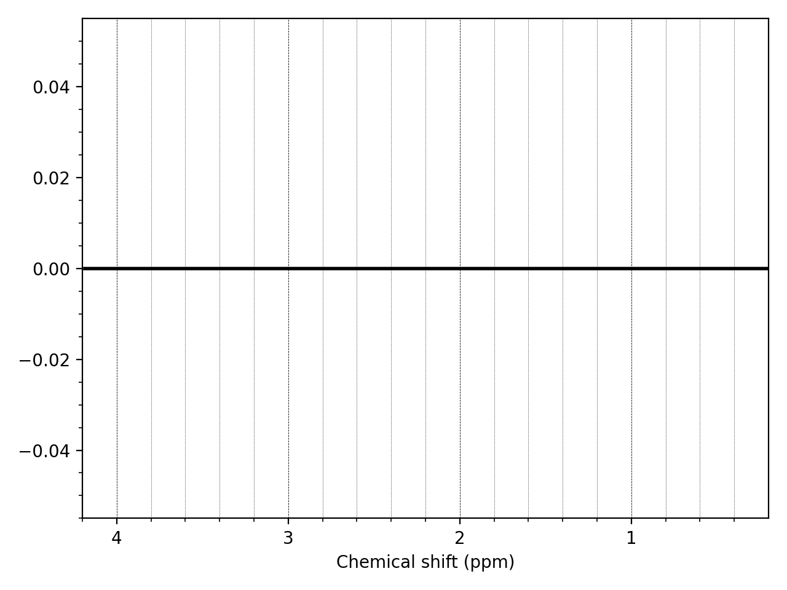

=============================
Troubleshooting & Bug Reports
=============================

Troubleshooting hints and tips will be added here. If you are having a problem which cannot be solved by anything on this page, either try searching the `FSL
mailing list <https://www.jiscmail.ac.uk/cgi-bin/webadmin?A0=FSL>`_ archives to see if somebody else has had the same problem, or send a email to the mailing list.

MRS specific questions may be better answered on the `MRSHub forums <https://forum.mrshub.org/>`_.

Bug Reporting 
=============

Please report bugs on the public |fslmrs_github_tracker|_ or via email to the |dev_email|_.

Troubleshooting hints
=====================

1. Unable to find example data
    If you installed FSL-MRS through conda the example data can be downloaded directly from the GitLab repository `folder <https://git.fmrib.ox.ac.uk/fsl/fsl_mrs/-/tree/master/example_usage>`_.
 
2. Poor fits
    Two problems are commonly diagnosed when poor fits are seen:

    1)  Basis spectra are inconsistently scaled. For example empirically derived macromolecular basis spectra can be orders of magnitude larger than the other basis spectra. Before fitting, fsl_mrs(i) scales the magnitude of the data and basis spectra to a known range. Relative scales are preserved within the basis spectra. To permit fsl_mrs(i) to apply different scales to individual basis spectra use the :code:`--ind_scale` option with a list of basis names.

    2)  The data might have parameters unlike a 7T or 3T human *in vivo* brain spectrum. I.e. the spectrum originates from a pre-clinical system or from phantom. In this case the MCMC priors which are suitable for *in vivo* human case can be disabled using the :code:`--disable_MH_priors` option.

3. Identifying the correct files for conversion
    Raw data files, especially DICOM files can have obscure naming conventions. It can be difficult to determine which files should be converted for use in FSL-MRS. Tools such as gdcmdump from `GDCM <http://gdcm.sourceforge.net/>`_ can help in identifying the scans by giving you access to the DICOM headers.

.. _TS_4:

4. Data looks 'wrong' after conversion
    If when using :code:`mrs_vis` you see no signal and just noise try conjugating the data using :code:`fsl_mrs_proc conj` or try expanding the ppm range plotted :code:`--ppmlim -10 10`. If you see a flat line, then conversion failed. The data might be corrupted - did the acquisition complete successfully?
