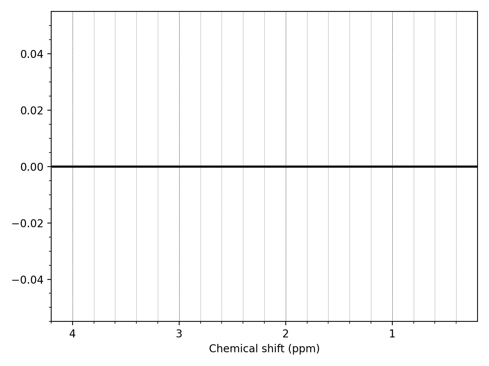

=============================
Troubleshooting & Bug Reports
=============================

Troubleshooting hints and tips will be added here. If you are having a problem which cannot be solved by anything on this page, either try searching the `FSL
mailing list <https://www.jiscmail.ac.uk/cgi-bin/webadmin?A0=FSL>`_ archives to see if somebody else has had the same problem, or send a email to the mailing list.

MRS specific questions may be better answered on the `MRSHub forums <https://forum.mrshub.org/>`_.

Bug Reporting 
=============

Please report bugs on the public |fslmrs_github_tracker|_ or via email to the |dev_email|_.

Troubleshooting hints
=====================

1. Unable to find example data
    If you installed FSL-MRS through conda the example data can be downloaded directly from the GitLab repository `folder <https://git.fmrib.ox.ac.uk/fsl/fsl_mrs/-/tree/master/example_usage>`_.
 
2. Poor fits
    Three problems are commonly diagnosed when poor fits are seen:

    1) Basis spectra are inconsistently scaled. For example empirically derived macromolecular basis spectra can be orders of magnitude larger than the other basis spectra. Before fitting, fsl_mrs(i) scales the magnitude of the data and basis spectra to a known range. Relative scales are preserved within the basis spectra. To permit fsl_mrs(i) to apply different scales to individual basis spectra use the :code:`--ind_scale` option with a list of basis names.

    2) The data might have parameters unlike a 7T or 3T human *in vivo* brain spectrum. I.e. the spectrum originates from a pre-clinical system or from phantom. In this case the MCMC priors which are suitable for *in vivo* human case can be disabled using the :code:`--disable_MH_priors` option. Priors can be fine tuned by altering the values in :code:`fsl_mrs.utils.constants`.

    3) MR spectrum needs conjugation. Since FSL-MRS 3.0.0 release, MRS FIDs are no longer automatically conjugated. Hence, the input data might not be in the correct NIfTI-MRS convention and require a manual conjugation to be performed. To achieve this, one may use the following `mrs_tools` command: 

        ::

            mrs_tools conjugate --file <input_file> --output <output_folder> --filename <output_filename>
        
     a) Since FSL-MRS 3.0.0 release, the results html file will still be created even if the fitting has failed. Although, an explicit reason of the failure will not be given, a visual inspection of the results might make it apparent that the file needs to be conjugated. An example of such results are shown below.

        Before conjugation:

        .. image:: data/bad_fit.png
            :width: 600

        After conjugation:

        .. image:: data/good_fit.png
            :width: 600

3. Identifying the correct files for conversion
    Raw data files, especially DICOM files can have obscure naming conventions. It can be difficult to determine which files should be converted for use in FSL-MRS. Tools such as gdcmdump from `GDCM <http://gdcm.sourceforge.net/>`_ can help in identifying the scans by giving you access to the DICOM headers.

.. _TS_4:

4. Data looks 'wrong' after conversion
    If when using :code:`mrs_tools vis` you see no signal and just noise try conjugating the data using :code:`fsl_mrs_proc conj` or try expanding the ppm range plotted :code:`--ppmlim -10 10`. If you see a flat line, then conversion failed. The data might be corrupted - did the acquisition complete successfully?

5. Parallel processing on the FMRIB SLURM cluster does not work.
    If `fsl_mrsi` or `fsl_dynmrs` is run on the cluster with ``--parallel cluster`` option, then a dask yaml config file needs to be available under ``~/.config/dask`` or ``/etc/dask``. If dask cannot find an appropriate config for the command, then it will raise a `KeyError`. Example of a valid config for the FMRIB cluster is shown below:

    .. code-block:: yaml

        jobqueue:

            fsl_mrsi:
                name: dask-worker

                # Dask worker options
                cores: 2                                       # Total number of cores per job
                memory: '2GB'                                  # Total amount of memory per job
                processes: null                                # Number of Python processes per job

                python: null                                   # Python executable
                interface: bond0.148                           # Network interface to use like eth0 or ib0
                death-timeout: 60                              # Number of seconds to wait if a worker can not find a scheduler
                local-directory: null                          # Location of fast local storage like /scratch or $TMPDIR
                shared-temp-directory: null                    # Shared directory currently used to dump temporary security objects for workers
                extra: null                                    # deprecated: use worker-extra-args
                worker-command: "distributed.cli.dask_worker"  # Command to launch a worker
                worker-extra-args: []                          # Additional arguments to pass to `dask-worker`

                # SLURM resource manager options
                shebang: "#!/usr/bin/env bash"
                queue: 'interactive'
                account: null
                walltime: '00:30:00'
                env-extra: null
                job-script-prologue: []
                job-cpu: null
                job-mem: null
                job-extra: null
                job-extra-directives: []
                job-directives-skip: []
                log-directory: null

                # Scheduler options
                scheduler-options: {}

            fsl_dynmrs:
                name: dask-worker

                # Dask worker options
                cores: 2                                       # Total number of cores per job
                memory: '2GB'                                  # Total amount of memory per job
                processes: null                                # Number of Python processes per job

                python: null                                   # Python executable
                interface: bond0.148                           # Network interface to use like eth0 or ib0
                death-timeout: 60                              # Number of seconds to wait if a worker can not find a scheduler
                local-directory: null                          # Location of fast local storage like /scratch or $TMPDIR
                shared-temp-directory: null                    # Shared directory currently used to dump temporary security objects for workers
                extra: null                                    # deprecated: use worker-extra-args
                worker-command: "distributed.cli.dask_worker"  # Command to launch a worker
                worker-extra-args: []                          # Additional arguments to pass to `dask-worker`

                # SLURM resource manager options
                shebang: "#!/usr/bin/env bash"
                queue: 'interactive'
                account: null
                walltime: '00:30:00'
                env-extra: null
                job-script-prologue: []
                job-cpu: null
                job-mem: null
                job-extra: null
                job-extra-directives: []
                job-directives-skip: []
                log-directory: null

                # Scheduler options
                scheduler-options: {}

    **Note:** More details on how to set up a dask config file can be found `here <https://jobqueue.dask.org/en/latest/clusters-configuration-setup.html>`_.