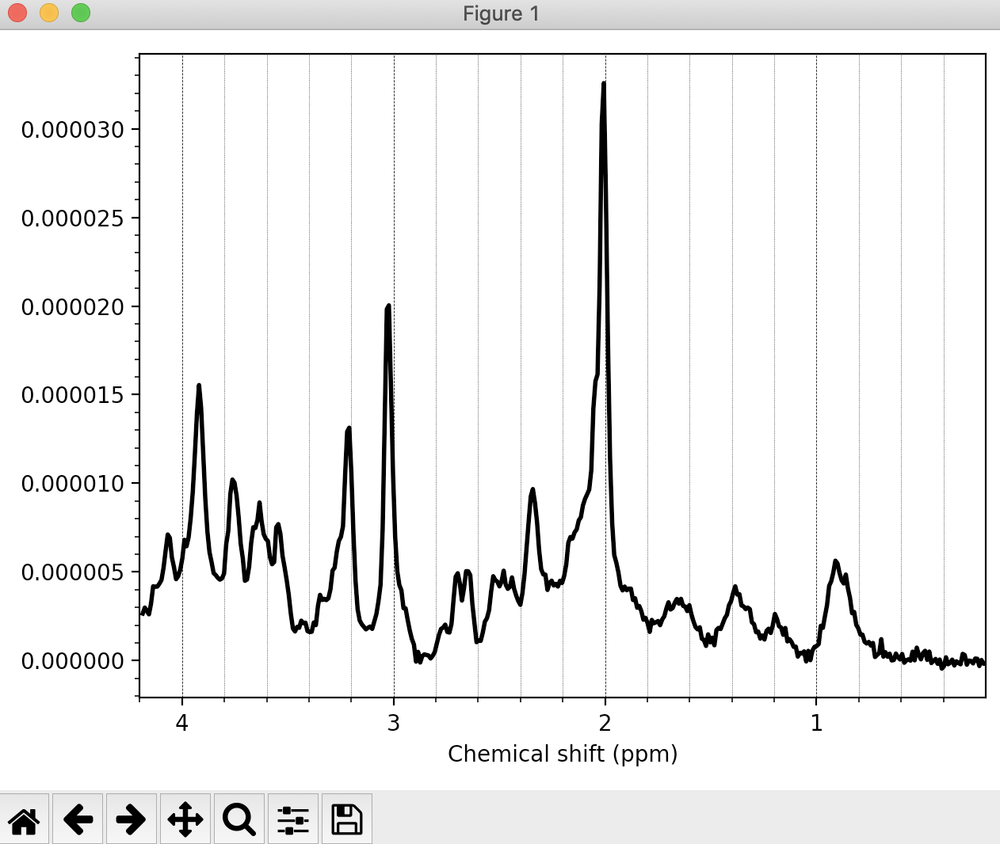
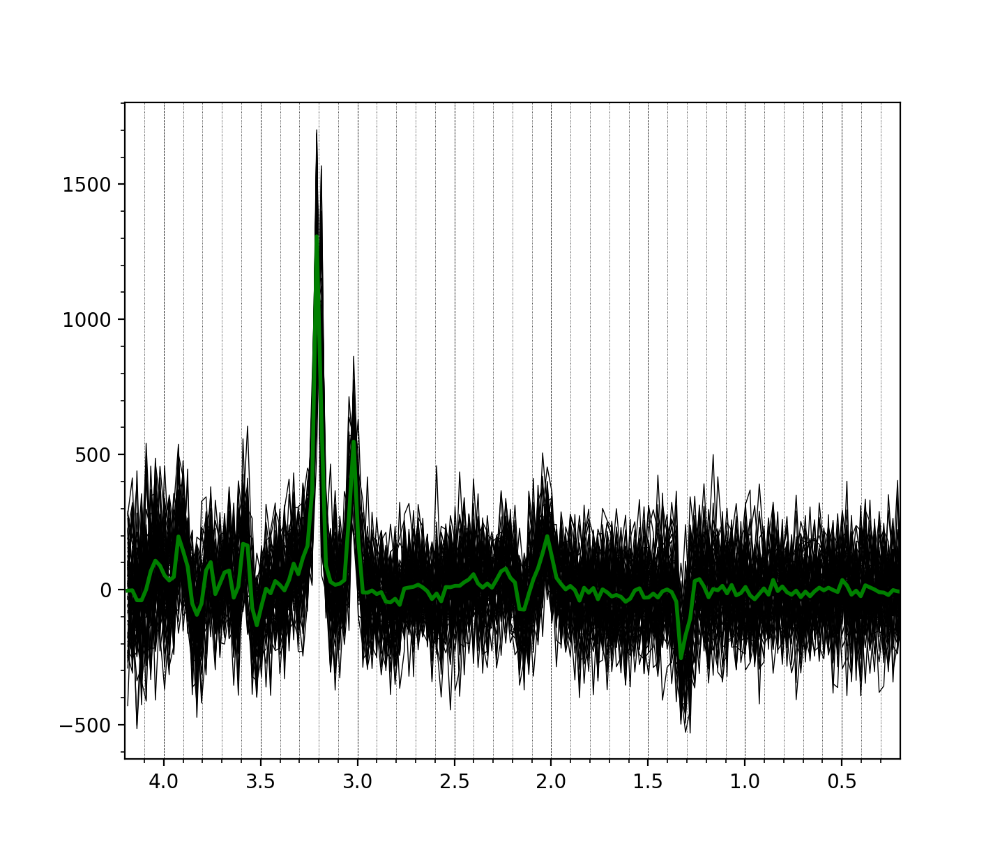
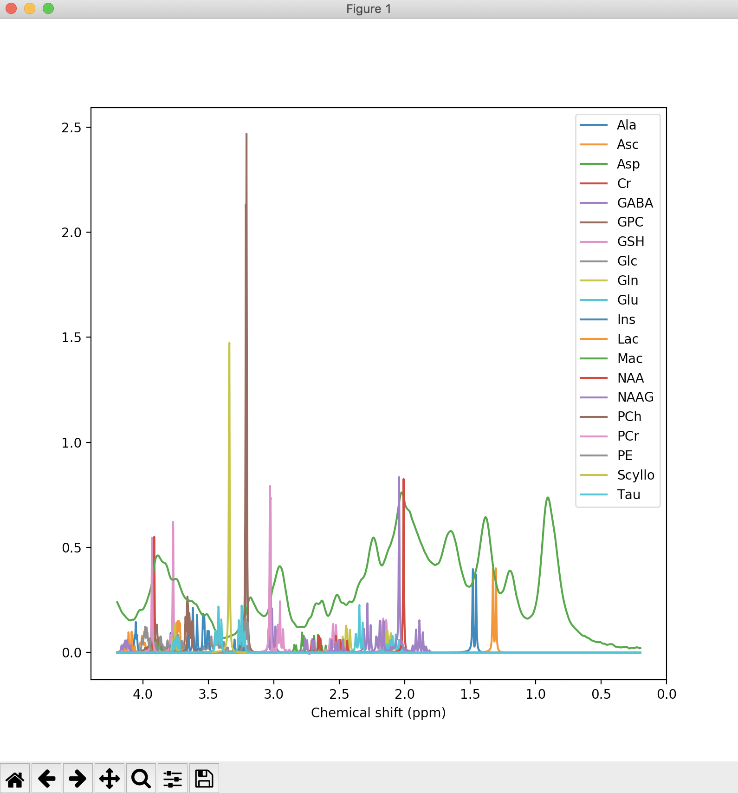
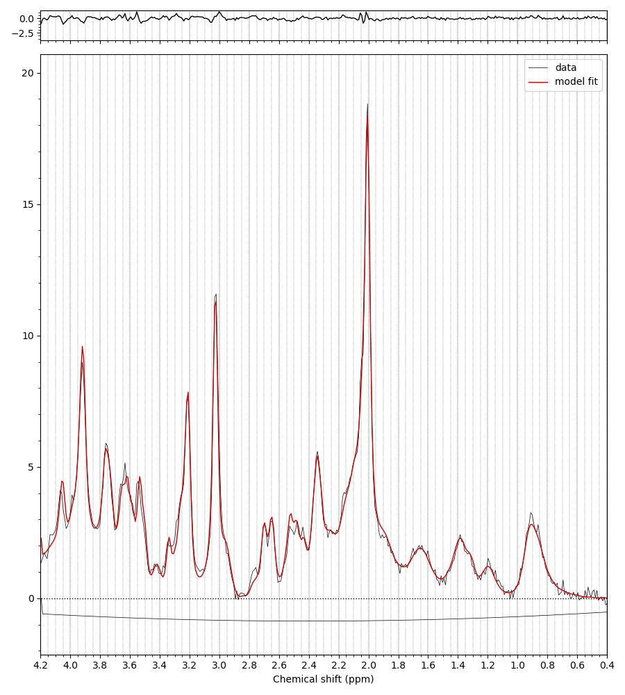
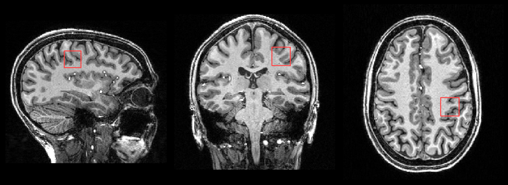

.. _visualisation:

Reports and Visualisation
=========================

Data and analysis results can be viewed in a number of ways in FSL-MRS, and at all stages of processing. 

There are five ways of visualising/interacting with MRS data in FSL-MRS:

1. Quick glance (human-readable, non-interactive) 
2. CSV files (human- and machine-readable) 
3. HTML reports (fairly interactive) 
4. FSLeyes (highly interactive)
5. SVS results dashboard (interactive)

1. Quick glance
---------------

The first thing one might want to do when given a FID file or simulated spectra is to have a quick look at the spectra to see if they look like one would expect. To get a sense of the dimensionality and basic status of the data run :code:`mrs_tools info` for a quick text summary. FSL-MRS then provides a light-weight script (:code:`mrs_tools vis`) to quickly visualise the MRS or MRSI data. For example, running :code:`mrs_tools vis` on the provided example SVS data:

::

    mrs_tools vis example_usage/example_data/metab.nii

gives the following basic plot:

Note that the reason :code:`mrs_tools vis` "knows" how to scale the x-axis is that the relevant information is stored in the NIfTI-MRS MRS header extension (namely the *dwell time* and the *central frequency*).

:code:`mrs_tools vis` can also visualise a folder of mrs data::

    mrs_tools vis ./converted_data_dir/

We can also run :code:`mrs_tools vis` to visualise the metabolite basis. Again below we do so for the simulated basis provided with the example data:

::

  mrs_tools vis example_usage/example_data/steam_11ms/

Additionally, the :code:`fsl_mrs` and :code:`fsl_mrsi` wrapper scripts output a PNG file (**fit_summary.png**) that summarises the fitting (overlays the FID spectrum, baseline, and model prediction). An example such file is shown below:

When a T1 image is provided, the SVS voxel location is also shown both the HTML reports and in a PNG file (**voxel_location.png**):

2. CSV files
------------

The FSL-MRS wrapper scripts generate several CSV files containing the fitted concentrations, QC values, and MCMC samples (when using the flag :code:`--algo MH`). These can be read out by another tool (e.g. Pandas) for further analyses/statistics.

3. HTML Reports
---------------

FSL-MRS can generate interactive HTML reports either through the wrapper scripts (:code:`fsl_mrs` and :code:`fsl_mrsi`) or from within a python script or IPython/Jupyter Notebook session. The interactive visualisation uses the Plotly library and allows one to interrogate the FID data and fitting, as well as looking at the correlation between fitted concentrations, uncertainties, and visualising single metabolite spectra alongside the data.

4. FSLeyes
----------

A very powerful way to visualise MRS data is FSLeyes (for compatibility with FSL-MRS, this requires FSLeyes version 0.32.0 or later). This is particularly useful for MRSI data, where we can simultaneously view the spectrum and fitted model alongside the anatomical image and interactively navigate from voxel to voxel.

Below are instructions for loading and configuring FSLeyes to work with MRSI data. Say the input FID (used for fitting) is :code:`FID_Metab.nii.gz` and the output from :code:`fsl_mrsi` is a folder called :code:`mrsi_output`. You can load these data into FSLeyes with:

::

    fsleyes  mrsi_out/{fit.nii.gz,baseline.nii.gz,residual.nii.gz} FID_Metab.nii.gz T1.nii &

Then open *View=>Power Spectra*, select the FID/fit/baseline/residuals as required for display. 

Now to make the power-spectrum display nicely, we need to change the x-axis scaling/shifting to be compatible with MRS conventions (shifted PPM). Open the Power spetrum control panel, and do the following:

 - Invert X axis
 - Set X axis scale to 1/{central frequency}
 - Set X axis offset to 4.65 (Shift of water to Tetramethylsilane)
 - Untick "Autoscale X" and Set X axis limits to a desired PPM range (e.g. [.2,4.2])
 - Untick "Normalise to unit variance"

 You should be able to see something like this (after playing around with changing the colours and the panel locations):

 .. image:: data/fsleyes.png
  :width: 700

5. SVS results dashboard
------------------------

**Warning: experimental / new feature**

The results from multiple single voxel (SVS) fits can be viewed on a single webpage by using the `fsl_mrs_summarise` command. For example:

.. code-block::

  fsl_mrs_summarise results_dir/

Where :code:`results_dir/` contains sub-directories of results generated by the :code:`fsl_mrs` command.

 .. image:: data/fsl_mrs_summarise_0.png
  :width: 700

This generates an interactive `Dash` app that displays metabolite concentrations, uncertainties, and QC parameters (SNR and linewidths). Sumamry statistics are given in table form below.

By selecting one of the plotted datasets, the data + fit is displayed lower in the page.

 .. image:: data/fsl_mrs_summarise_1.png
  :width: 700

 .. image:: data/fsl_mrs_summarise_2.png
  :width: 700

The single dataset + fit is displayed next to the mean (±1SD) data and fit.